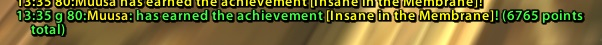

# AnnounceAchievements
Replicate original retail WoTLK client behaviour of achievement announces in guild chat to the Classic 3.4.x client. By default includes current achievement point status in message, it can be removed by deleting `" .. " (" .. GetTotalAchievementPoints() .. " points total)` from row 5 of announce.lua.

